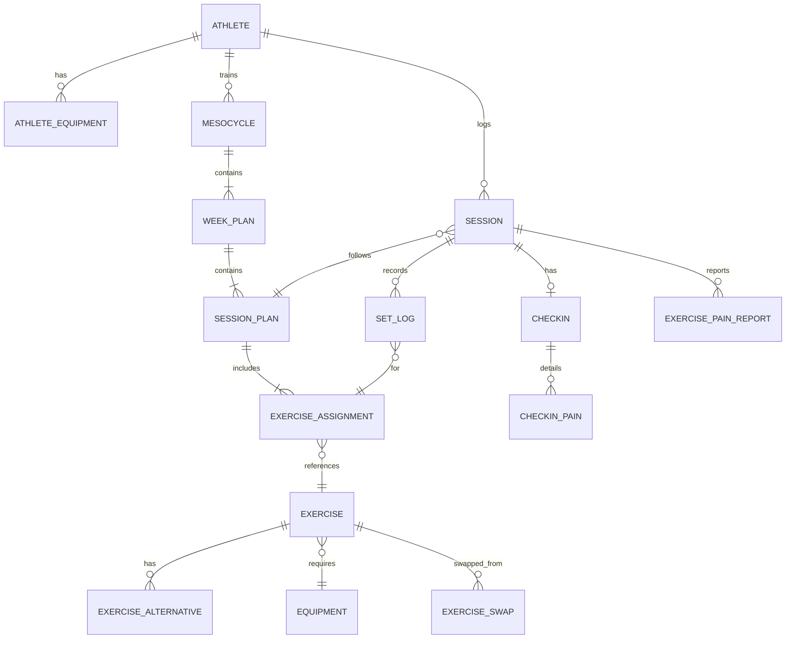

# PLAN-001 — SmartForge MVP — Plan técnico de implementación

> Derivado de `specs/001-SmartForge-mvp/spec.md` y `docs/constitution.md`.
> No contiene código; define estructura, modelo, algoritmos, contrato API, decisiones y tests.

---

## 1. Estructura de módulos

```
SmartForge/
├── docs/
│   └── constitution.md
├── specs/
│   └── 001-SmartForge-mvp/
│       ├── spec.md
│       └── plan.md                  ← este archivo
├── contract/
│   └── openapi.yaml                 ← Fuente de verdad (Constitución §1)
├── backend/
│   ├── src/
│   │   ├── config/                  # Variables de entorno, DB connection pool
│   │   ├── routes/                  # Solo enrutamiento HTTP (Constitución §3)
│   │   │   ├── auth.routes.ts             → RF-01
│   │   │   ├── profile.routes.ts          → RF-01
│   │   │   ├── mesocycle.routes.ts        → RF-02, RF-10
│   │   │   ├── routine.routes.ts          → RF-03
│   │   │   ├── session.routes.ts          → RF-04, RF-05, RF-06
│   │   │   ├── exercise.routes.ts         → RF-09
│   │   │   └── progression.routes.ts      → RF-07, RF-08
│   │   ├── controllers/             # Parseo, validación Zod, delega a Service
│   │   │   ├── auth.controller.ts
│   │   │   ├── profile.controller.ts
│   │   │   ├── mesocycle.controller.ts
│   │   │   ├── routine.controller.ts
│   │   │   ├── session.controller.ts
│   │   │   ├── exercise.controller.ts
│   │   │   └── progression.controller.ts
│   │   ├── services/                # Toda la lógica de negocio (Constitución §3)
│   │   │   ├── auth.service.ts            → RF-01 (OAuth flow)
│   │   │   ├── profile.service.ts         → RF-01 (CRUD perfil, validación edad)
│   │   │   ├── mesocycle-generator.service.ts  → RF-02 (generación de mesociclo)
│   │   │   ├── routine-editor.service.ts  → RF-03 (alternativas, reemplazo)
│   │   │   ├── checkin.service.ts         → RF-04 (fatiga/dolor pre-sesión)
│   │   │   ├── set-logger.service.ts      → RF-05 (registro de series)
│   │   │   ├── pain-report.service.ts     → RF-06 (molestia por ejercicio)
│   │   │   ├── progression.service.ts     → RF-07 (sobrecarga progresiva)
│   │   │   ├── fatigue-adjuster.service.ts → RF-08 (ajuste por fatiga/dolor)
│   │   │   ├── exercise-catalog.service.ts → RF-09 (catálogo, alternativas)
│   │   │   └── mesocycle-rotation.service.ts → RF-10 (rotación, deload)
│   │   ├── repositories/            # Solo acceso a datos (Constitución §3)
│   │   │   ├── athlete.repository.ts
│   │   │   ├── mesocycle.repository.ts
│   │   │   ├── session.repository.ts
│   │   │   ├── set-log.repository.ts
│   │   │   ├── checkin.repository.ts
│   │   │   ├── pain-report.repository.ts
│   │   │   ├── exercise.repository.ts
│   │   │   └── exercise-swap.repository.ts
│   │   ├── middleware/
│   │   │   ├── auth.middleware.ts          # Validación JWT Google
│   │   │   ├── validate.middleware.ts      # Validación Zod desde contrato
│   │   │   └── error-handler.middleware.ts
│   │   ├── schemas/                  # Tipos Zod generados desde openapi.yaml
│   │   │   └── generated/            # Auto-generado, no editar manualmente
│   │   └── db/
│   │       ├── migrations/           # Migraciones SQL secuenciales
│   │       └── seeds/
│   │           └── exercise-catalog.seed.ts  → RF-09 (200 ejercicios)
│   ├── tests/
│   │   ├── unit/                     # Tests de Service (Constitución §4)
│   │   └── contract/                 # Tests contra esquema OpenAPI
│   ├── package.json
│   └── tsconfig.json
├── frontend/
│   ├── src/
│   │   ├── api/                      # Clientes HTTP tipados (generados desde contrato)
│   │   ├── components/               # Componentes React reutilizables
│   │   │   ├── ui/                   # Botones ≥48px, inputs, cards (RNF-01, RNF-02)
│   │   │   ├── checkin/              → RF-04
│   │   │   ├── set-logger/           → RF-05
│   │   │   └── pain-report/          → RF-06
│   │   ├── pages/
│   │   │   ├── LoginPage.tsx              → RF-01
│   │   │   ├── ProfilePage.tsx            → RF-01
│   │   │   ├── MesocyclePage.tsx          → RF-02, RF-10
│   │   │   ├── RoutineEditorPage.tsx      → RF-03
│   │   │   ├── SessionPage.tsx            → RF-04, RF-05, RF-06
│   │   │   └── ExerciseDetailPage.tsx     → RF-09 (video)
│   │   ├── hooks/
│   │   │   ├── useOfflineSync.ts          → RNF-03
│   │   │   └── useAuth.ts                → RF-01
│   │   ├── stores/                   # Estado local / IndexedDB para offline
│   │   ├── sw/                       # Service Worker para PWA offline
│   │   │   └── service-worker.ts          → RNF-03
│   │   └── i18n/                     # Textos en español (Constitución §6)
│   ├── public/
│   │   └── manifest.json            # PWA manifest
│   ├── package.json
│   └── tsconfig.json
├── docker-compose.yml
└── .github/
    └── workflows/
        └── ci.yml                    # CI < 3 min (Constitución §4)
```

### Regla de dependencias entre capas (Constitución §3)

```
Routes ──→ Controllers ──→ Services ──→ Repositories ──→ PostgreSQL
  │              │              │
  └── NO ──→ Services    NO ──→ Repositories (saltar capa = violación)
```

---

## 2. Modelo de datos

### 2.1 Diagrama entidad-relación



### 2.2 Tablas principales (PostgreSQL, snake_case — AGENTS.md)

> Todas las FK llevan `ON DELETE` explícito (Constitución §5).

| Tabla                  | Columnas clave                                                                                                                                                                             | ON DELETE | Soft-delete       | Cubre RF     |
| ---------------------- | ------------------------------------------------------------------------------------------------------------------------------------------------------------------------------------------ | --------- | ----------------- | ------------ |
| `athlete`              | id (PK), google_id (UNIQUE), name, age, body_weight_kg, experience_level, goal, available_days, deleted_at                                                                                 | —         | Sí (`deleted_at`) | RF-01        |
| `athlete_equipment`    | athlete_id (FK→athlete), equipment_id (FK→equipment)                                                                                                                                       | CASCADE   | No                | RF-01        |
| `equipment`            | id (PK), slug, name_es                                                                                                                                                                     | —         | No                | RF-01, RF-09 |
| `exercise`             | id (PK), name_es, primary_muscle, secondary_muscles[], primary_joint, movement_pattern, exercise_type, equipment_id (FK→equipment, NULL=bodyweight), initial_load_ratio, video_url, active | RESTRICT  | No (usa `active`) | RF-09        |
| `exercise_alternative` | exercise_id (FK→exercise), alternative_id (FK→exercise)                                                                                                                                    | CASCADE   | No                | RF-09        |
| `mesocycle`            | id (PK), athlete_id (FK→athlete), status (active/archived/abandoned), total_weeks, periodization_type, start_date, end_date, created_at                                                    | SET NULL  | No                | RF-02, RF-10 |
| `week_plan`            | id (PK), mesocycle_id (FK→mesocycle), week_number, is_deload                                                                                                                               | CASCADE   | No                | RF-02, RF-10 |
| `session_plan`         | id (PK), week_plan_id (FK→week_plan), day_of_week, order_in_week                                                                                                                           | CASCADE   | No                | RF-02        |
| `exercise_assignment`  | id (PK), session_plan_id (FK→session_plan), exercise_id (FK→exercise), sets_target, reps_target_min, reps_target_max, load_kg, order_in_session                                            | CASCADE   | No                | RF-02, RF-05 |
| `exercise_swap`        | id (PK), exercise_assignment_id (FK→exercise_assignment), original_exercise_id, new_exercise_id, reason, created_at                                                                        | CASCADE   | No                | RF-03        |
| `session`              | id (PK), athlete_id (FK→athlete), session_plan_id (FK→session_plan), status (pending/in_progress/completed/incomplete), started_at, completed_at, deleted_at                               | SET NULL  | Sí (`deleted_at`) | RF-04, RF-05 |
| `checkin`              | id (PK), session_id (FK→session, UNIQUE), fatigue_level (1-5), created_at                                                                                                                  | CASCADE   | No                | RF-04        |
| `checkin_pain`         | id (PK), checkin_id (FK→checkin), joint, side (left/right/bilateral), intensity (mild/moderate/severe)                                                                                     | CASCADE   | No                | RF-04        |
| `set_log`              | id (PK), session_id (FK→session), exercise_assignment_id (FK→exercise_assignment), set_number, weight_kg (≥0, step 0.5), reps_completed, rir (0-5), created_at, client_timestamp           | CASCADE   | No                | RF-05        |
| `exercise_pain_report` | id (PK), session_id (FK→session), exercise_assignment_id (FK→exercise_assignment), joint, side, intensity, created_at                                                                      | CASCADE   | No                | RF-06        |

### 2.3 Ejemplo JSON — Sesión completa (respuesta API)

```json
{
  "session": {
    "id": "s_01JXYZ",
    "status": "completed",
    "started_at": "2025-03-15T18:30:00Z",
    "completed_at": "2025-03-15T19:45:00Z",
    "session_plan": {
      "id": "sp_042",
      "day_of_week": 1,
      "week": { "week_number": 3, "is_deload": false }
    },
    "checkin": {
      "fatigue_level": 3,
      "pains": [{ "joint": "rodilla", "side": "izquierda", "intensity": "leve" }]
    },
    "exercises": [
      {
        "assignment_id": "ea_101",
        "exercise": {
          "id": "ex_001",
          "name_es": "Sentadilla con barra",
          "movement_pattern": "rodilla-dominante",
          "exercise_type": "compuesto",
          "video_url": "https://youtube.com/watch?v=abc123"
        },
        "sets_target": 4,
        "reps_target_min": 8,
        "reps_target_max": 12,
        "load_kg": 60.0,
        "sets_logged": [
          {
            "set_number": 1,
            "weight_kg": 60.0,
            "reps_completed": 10,
            "rir": 2
          },
          {
            "set_number": 2,
            "weight_kg": 60.0,
            "reps_completed": 10,
            "rir": 2
          },
          {
            "set_number": 3,
            "weight_kg": 60.0,
            "reps_completed": 9,
            "rir": 1
          },
          {
            "set_number": 4,
            "weight_kg": 60.0,
            "reps_completed": 8,
            "rir": 0
          }
        ],
        "pain_report": null,
        "progression_suggestion": {
          "action": "maintain",
          "reason": "Completaste 3 de 4 series con RIR ≥ 2. Se mantiene carga para la próxima sesión.",
          "next_load_kg": 60.0,
          "next_reps_target": 10
        }
      },
      {
        "assignment_id": "ea_102",
        "exercise": {
          "id": "ex_045",
          "name_es": "Curl de bíceps con mancuerna",
          "movement_pattern": "tirón",
          "exercise_type": "monoarticular",
          "video_url": "https://youtube.com/watch?v=def456"
        },
        "sets_target": 3,
        "reps_target_min": 10,
        "reps_target_max": 15,
        "load_kg": 10.0,
        "sets_logged": [
          { "set_number": 1, "weight_kg": 10.0, "reps_completed": 15, "rir": 3 },
          { "set_number": 2, "weight_kg": 10.0, "reps_completed": 15, "rir": 2 },
          { "set_number": 3, "weight_kg": 10.0, "reps_completed": 14, "rir": 2 }
        ],
        "pain_report": {
          "joint": "codo",
          "side": "derecha",
          "intensity": "leve"
        },
        "progression_suggestion": {
          "action": "increase",
          "reason": "Completaste todas las reps con RIR ≥ 2 en la última sesión (principiante). Se aumenta carga +2.5 kg.",
          "next_load_kg": 12.5,
          "next_reps_target": 10
        }
      }
    ]
  }
}
```

---

## 3. Algoritmos centrales en pseudocódigo

### 3.1 Algoritmo de sobrecarga progresiva (RF-07, RF-08)

> "Racha" = secuencia de sesiones exitosas consecutivas del mismo ejercicio.

```
FUNCIÓN calcular_próxima_carga(atleta, ejercicio) → Sugerencia:

  nivel       ← atleta.experience_level            // principiante|intermedio|avanzado
  historial   ← obtener_últimas_sesiones(atleta, ejercicio, límite=3)

  // ── CL-11: Sin historial → carga inicial ──
  SI historial está vacío:
    ratio ← ejercicio.initial_load_ratio
             ?? ratio_por_defecto(ejercicio.movement_pattern, ejercicio.exercise_type, nivel)
    RETORNAR Sugerencia(
      acción  = "initial",
      carga   = REDONDEAR(atleta.body_weight_kg × ratio, paso=0.5),
      reps    = ejercicio.reps_target_min,
      motivo  = "Carga estimada a partir de tu peso corporal y nivel"
    )

  // ── CL-08: Inactividad ──
  días_inactivo ← hoy − última_sesión.fecha
  SI días_inactivo ≥ 28:
    RETORNAR Sugerencia(acción = "reset", motivo = "Inactividad ≥ 4 semanas → nuevo mesociclo")
  SI días_inactivo ≥ 14:
    RETORNAR Sugerencia(
      acción = "reduce",
      carga  = última_carga × 0.90,
      motivo = "Inactividad ≥ 2 semanas → carga −10%"
    )

  // ── Configuración por nivel ──
  TABLA progresión:
    principiante → { sesiones_para_subir: 1, Δ_compuesto: +5.0, Δ_mono: +2.5 }
    intermedio   → { sesiones_para_subir: 2, Δ_compuesto: +2.5, Δ_mono: +1.25 }
    avanzado     → { sesiones_para_subir: 3, Δ_compuesto: +2.5, Δ_mono: +1.25 }

  config  ← progresión[nivel]
  Δ_carga ← SI ejercicio.exercise_type == "compuesto"
               ENTONCES config.Δ_compuesto
               SINO     MAX(config.Δ_mono, 0.5)

  // ── Contar racha de éxitos consecutivos (desde la más reciente) ──
  racha_éxitos ← 0
  PARA CADA sesión EN historial (más reciente primero):
    SI todas_las_series_exitosas(sesión, ejercicio):
      // Éxito = reps_completadas ≥ reps_objetivo Y rir ≥ 2 en TODAS las series
      racha_éxitos ← racha_éxitos + 1
    SINO:
      ROMPER  // la racha se corta

  // ── CA-07.1: ¿Subir carga? ──
  SI racha_éxitos ≥ config.sesiones_para_subir:
    nueva_carga ← última_carga + Δ_carga

    // Doble progresión: si el incremento no es viable
    SI nueva_carga NO es alcanzable con el equipamiento disponible:
      SI reps_actuales < reps_target_max:
        RETORNAR Sugerencia(
          acción = "increase_reps",
          carga  = última_carga,
          reps   = reps_actuales + 1,
          motivo = "Doble progresión: +1 rep antes de subir peso"
        )

    RETORNAR Sugerencia(
      acción = "increase_load",
      carga  = nueva_carga,
      reps   = reps_target_min,   // reset reps al mínimo del rango
      motivo = "Completaste {reps}×{series}@{carga}kg con RIR ≥ 2
                en las últimas {racha_éxitos} sesión(es)"
    )

  // ── CA-07.2: Contar fallos en ventana de 3 ──
  fallos ← CONTAR sesiones EN historial DONDE NO todas_las_series_exitosas
  fallos_consecutivos ← contar_fallos_consecutivos(historial)

  SI fallos_consecutivos ≥ 3:
    RETORNAR Sugerencia(
      acción = "deload",
      carga  = última_carga × 0.90,
      motivo = "3 sesiones consecutivas con fallo → deload −10%"
    )
  SI fallos ≥ 2:
    RETORNAR Sugerencia(
      acción = "reduce",
      carga  = última_carga × 0.95,
      motivo = "2 fallos en la ventana → carga −5%"
    )

  // Fallo en 1 sola sesión → mantener
  RETORNAR Sugerencia(
    acción = "maintain",
    carga  = última_carga,
    motivo = "Se mantiene carga; fallo aislado"
  )


FUNCIÓN todas_las_series_exitosas(sesión, ejercicio) → bool:
  series ← obtener_sets_del_ejercicio(sesión, ejercicio)
  RETORNAR PARA TODA s EN series:
    s.reps_completed ≥ s.reps_target Y s.rir ≥ 2
```

### 3.2 Algoritmo de ajuste por fatiga y dolor (RF-08)

```
FUNCIÓN ajustar_sesión_por_fatiga_dolor(atleta, sesión_plan) → Plan_Ajustado:

  ventana    ← obtener_últimos_checkins(atleta, límite=3)
  reportes   ← obtener_últimos_pain_reports(atleta, límite=3)  // RF-04 + RF-06

  // ── Mapa de dolor por articulación (D-20: prevalece la más severa) ──
  dolor_map  ← {}   // joint+side → intensidad máxima
  PARA CADA reporte EN (ventana.pains + reportes):
    clave ← reporte.joint + ":" + reporte.side
    dolor_map[clave] ← MAX(dolor_map[clave], reporte.intensity)

  plan_ajustado ← COPIAR sesión_plan
  avisos ← []

  PARA CADA asignación EN plan_ajustado.exercises:
    articulación ← asignación.exercise.primary_joint
    claves_relevantes ← buscar_claves(articulación, dolor_map)

    severidad ← MAX(dolor_map[c] PARA c EN claves_relevantes) ?? NINGUNA

    SI severidad == "severa":
      // CA-08.1: Excluir y proponer alternativa
      alternativa ← buscar_alternativa_sin_articulación(
        ejercicio    = asignación.exercise,
        articulación = articulación,
        equipamiento = atleta.equipment
      )
      SI alternativa EXISTE:
        asignación.exercise ← alternativa
        avisos.AGREGAR("Se reemplazó {original} por {alternativa}: dolor severo en {articulación}")
      SINO:
        asignación.omitido ← VERDADERO
        avisos.AGREGAR("Se omitió {original}: dolor severo en {articulación}, sin alternativa")

    SI severidad == "moderada":
      // CA-08.2: Reducir volumen
      sesiones_con_moderado ← contar_sesiones_con_dolor(articulación, "moderada", ventana)
      factor ← SI sesiones_con_moderado ≥ 2 ENTONCES 0.50 SINO 0.30
      asignación.sets_target ← MAX(1, REDONDEAR(asignación.sets_target × (1 − factor)))
      avisos.AGREGAR("Se redujo volumen de {ejercicio} un {factor×100}%: dolor moderado en {articulación}")

    // CA-08.3: Leve → sin ajuste, solo tracking

  // ── CA-08.4: Fatiga general alta ──
  fatiga_consecutiva ← contar_fatiga_alta_consecutiva(ventana)  // ≥ 4/5
  SI fatiga_consecutiva ≥ 2:
    plan_ajustado.deload_reactivo ← VERDADERO
    avisos.AGREGAR("Fatiga alta sostenida (2+ sesiones) → se propone deload reactivo")

  // ── CA-08.5: Patrón completo excluido ──
  PARA CADA patrón EN [empuje, tirón, rodilla-dominante, cadera-dominante, core]:
    ejercicios_del_patrón ← FILTRAR plan_ajustado.exercises POR movement_pattern == patrón
    SI TODOS están omitidos:
      avisos.AGREGAR("Sesión reducida: se excluyó {patrón} por dolor articular reportado")

  SI TODOS los ejercicios están omitidos:
    plan_ajustado.descanso_total ← VERDADERO
    avisos.AGREGAR("No quedan ejercicios viables. Se sugiere descanso total hoy.")

  plan_ajustado.avisos ← avisos
  RETORNAR plan_ajustado
```

### 3.3 Algoritmo de generación de mesociclo (RF-02, RF-10)

```
FUNCIÓN generar_mesociclo(atleta) → Mesociclo:

  semanas ← { principiante: 4, intermedio: 6, avanzado: 8 }[atleta.experience_level]
  tipo_periodización ← SI atleta.goal == "fuerza" ENTONCES "lineal" SINO "ondulante"

  // ── Seleccionar ejercicios del catálogo ──
  ejercicios_disponibles ← FILTRAR catálogo POR:
    (equipamiento ∈ atleta.equipment) O (equipamiento == NULL)  // peso corporal
    Y active == VERDADERO
    // RF-10 rotación: verificar dolor
    Y articulación_principal SIN dolor moderado/severo en últimas 3 sesiones

  // ── Distribuir por split según días disponibles ──
  split ← decidir_split(atleta.available_days)
    // 1 día → full-body (CL-01)
    // 2 días → upper/lower
    // 3 días → push/pull/legs
    // 4+ días → push/pull/legs + variantes

  PARA CADA semana EN 1..semanas:
    is_deload ← (semana == semanas)  // Última semana siempre es deload

    PARA CADA día EN split:
      sesión ← crear_sesión_plan(día)

      PARA CADA slot EN día.slots:
        ejercicio ← seleccionar_ejercicio(
          patrón     = slot.movement_pattern,
          músculo    = slot.primary_muscle,
          disponibles = ejercicios_disponibles,
          preferencias = atleta.swaps_históricos  // RF-03 CA-03.4
        )

        // ── Calcular volumen y carga ──
        series  ← calcular_series(atleta.experience_level, semana, is_deload)
        reps    ← calcular_reps_objetivo(atleta.goal, ejercicio.exercise_type)
        carga   ← calcular_carga_semana(atleta, ejercicio, semana, tipo_periodización)

        SI is_deload:
          series ← REDONDEAR(series × 0.60)   // CA-10.2: −40% volumen
          carga  ← carga × 0.90               // CA-10.2: −10% intensidad

        sesión.AGREGAR(ExerciseAssignment(ejercicio, series, reps, carga))

  // ── Verificar balance (CA-02.1) ──
  VERIFICAR que todos los patrones [empuje, tirón, rodilla-dom, cadera-dom, core]
    están cubiertos. Si no → avisar (CA-02.2 volumen limitado).

  RETORNAR Mesociclo(semanas, sesiones, tipo_periodización)
```

---

## 4. Contrato de la API REST

> Todos los endpoints se definen primero en `contract/openapi.yaml` (Constitución §1).
> Validaciones de request/response derivadas de Zod generado desde el contrato (RNF-07).
> Textos de error en español (Constitución §6, RNF-05).

### 4.1 Endpoints

| Método         | Ruta                               | Descripción                             | RF           | Códigos de salida |
| -------------- | ---------------------------------- | --------------------------------------- | ------------ | ----------------- |
| **Auth**       |                                    |                                         |              |                   |
| `GET`          | `/api/auth/google`                 | Inicia flujo OAuth con Google           | RF-01        | 302               |
| `GET`          | `/api/auth/google/callback`        | Callback OAuth → JWT                    | RF-01        | 200, 401          |
| `GET`          | `/api/auth/me`                     | Perfil del atleta autenticado           | RF-01        | 200, 401          |
| **Perfil**     |                                    |                                         |              |                   |
| `POST`         | `/api/profile`                     | Crear perfil (post-registro)            | RF-01        | 201, 400, 409     |
| `PUT`          | `/api/profile`                     | Editar perfil                           | RF-01        | 200, 400          |
| `DELETE`       | `/api/profile`                     | Soft-delete de cuenta                   | RF-01        | 200               |
| **Mesociclo**  |                                    |                                         |              |                   |
| `POST`         | `/api/mesocycles`                  | Generar nuevo mesociclo                 | RF-02        | 201, 400          |
| `GET`          | `/api/mesocycles/current`          | Mesociclo activo con plan completo      | RF-02, RF-10 | 200, 404          |
| `GET`          | `/api/mesocycles/:id`              | Detalle de un mesociclo                 | RF-02        | 200, 404          |
| **Rutina**     |                                    |                                         |              |                   |
| `GET`          | `/api/exercises/:id/alternatives`  | Alternativas para un ejercicio          | RF-03        | 200               |
| `POST`         | `/api/assignments/:id/swap`        | Reemplazar ejercicio en asignación      | RF-03        | 200, 400, 404     |
| **Sesión**     |                                    |                                         |              |                   |
| `POST`         | `/api/sessions`                    | Iniciar sesión de entrenamiento         | RF-04        | 201, 400          |
| `POST`         | `/api/sessions/:id/checkin`        | Enviar check-in pre-sesión              | RF-04        | 201, 400, 409     |
| `POST`         | `/api/sessions/:id/sets`           | Registrar una serie                     | RF-05        | 201, 400          |
| `PUT`          | `/api/sets/:id`                    | Editar serie registrada                 | RF-05        | 200, 400, 404     |
| `DELETE`       | `/api/sets/:id`                    | Eliminar serie registrada               | RF-05        | 204, 404          |
| `POST`         | `/api/sessions/:id/pain-reports`   | Reportar molestia por ejercicio         | RF-06        | 201, 400          |
| `PATCH`        | `/api/sessions/:id/complete`       | Marcar sesión como completada           | RF-05        | 200, 400          |
| **Progresión** |                                    |                                         |              |                   |
| `GET`          | `/api/assignments/:id/progression` | Sugerencia de carga para próxima sesión | RF-07, RF-08 | 200               |
| **Catálogo**   |                                    |                                         |              |                   |
| `GET`          | `/api/exercises`                   | Listar ejercicios (con filtros)         | RF-09        | 200               |
| `GET`          | `/api/exercises/:id`               | Detalle de ejercicio con video          | RF-09        | 200, 404          |
| **Sync**       |                                    |                                         |              |                   |
| `POST`         | `/api/sync`                        | Sincronizar datos offline               | RNF-03       | 200, 207, 401     |

### 4.2 Códigos de estado HTTP

| Código | Significado en SmartForge                                                     |
| ------ | ----------------------------------------------------------------------------- |
| `200`  | OK — Operación exitosa                                                        |
| `201`  | Created — Recurso creado (perfil, sesión, serie, mesociclo)                   |
| `204`  | No Content — Recurso eliminado                                                |
| `207`  | Multi-Status — Sync parcial: algunos registros aceptados, otros con conflicto |
| `302`  | Redirect — Redirección OAuth                                                  |
| `400`  | Bad Request — Validación Zod falló (edad < 16, RIR > 5, peso < 0, etc.)       |
| `401`  | Unauthorized — Token inválido o expirado (CL-18)                              |
| `404`  | Not Found — Recurso no existe                                                 |
| `409`  | Conflict — Duplicado (email ya registrado CA-01.3, check-in ya enviado)       |

### 4.3 Ejemplo de response — Sugerencia de progresión

```json
// GET /api/assignments/ea_101/progression
// 200 OK
{
  "assignment_id": "ea_101",
  "exercise_name": "Sentadilla con barra",
  "current_load_kg": 60.0,
  "suggestion": {
    "action": "increase_load", // increase_load | increase_reps | maintain | reduce | deload | initial
    "next_load_kg": 65.0,
    "next_reps_target": 8,
    "reason": "Completaste 4×10@60kg con RIR ≥ 2 en la última sesión. Se aumenta carga +5 kg."
  },
  "streak_count": 1,
  "window_sessions": 3
}
```

---

## 5. CLI de desarrollo

> Comandos del proyecto, no del producto. Coherentes con AGENTS.md.

| Comando                         | Descripción                                              | Código de salida          |
| ------------------------------- | -------------------------------------------------------- | ------------------------- |
| `docker-compose up -d`          | Levanta PostgreSQL + backend + frontend                  | 0=OK, 1=error             |
| `npm run dev --prefix backend`  | Backend dev server (Express + hot reload)                | 0=OK                      |
| `npm run dev --prefix frontend` | Frontend dev server (Vite)                               | 0=OK                      |
| `npm run generate:types`        | Genera esquemas Zod desde `contract/openapi.yaml`        | 0=OK, 1=contrato inválido |
| `npm run lint:openapi`          | Valida `openapi.yaml` con Spectral/Redocly               | 0=válido, 1=errores       |
| `npm run db:migrate`            | Ejecuta migraciones pendientes                           | 0=OK, 1=fallo             |
| `npm run db:seed`               | Seed del catálogo de ejercicios (200 ejercicios)         | 0=OK                      |
| `npm run test`                  | Tests unitarios + contrato (CI < 3 min, Constitución §4) | 0=todos pasan, 1=fallos   |
| `npm run test:unit`             | Solo tests unitarios de Services                         | 0=OK                      |
| `npm run test:contract`         | Solo tests de contrato contra OpenAPI                    | 0=OK                      |
| `npm run lint`                  | ESLint + Prettier check                                  | 0=OK, 1=errores           |
| `npm run format`                | Prettier auto-fix                                        | 0=OK                      |
| `npm run build`                 | Build de producción (frontend + backend)                 | 0=OK, 1=TSC falló         |

---

## 6. Decisiones técnicas justificadas

| #     | Decisión                                              | Justificación                                                                                                                                                                    | Alternativa descartada                                                                                                                                                   | RF/§                 |
| ----- | ----------------------------------------------------- | -------------------------------------------------------------------------------------------------------------------------------------------------------------------------------- | ------------------------------------------------------------------------------------------------------------------------------------------------------------------------ | -------------------- |
| DT-01 | **Express** como framework HTTP                       | Ligero, sin opinión sobre estructura → permite implementar capas estrictas (§3). Ecosistema maduro para middleware de autenticación y validación Zod.                            | Fastify: mayor rendimiento crudo, pero su sistema de plugins inyecta dependencias de forma que dificulta la separación estricta de capas.                                | §3, RF-01            |
| DT-02 | **PostgreSQL** como DB única                          | Modelo relacional con FK explícitas obligatorias (§5). Soporte nativo de arrays (músculos secundarios), JSONB si se necesita flexibilidad futura, y soft-delete eficiente.       | MongoDB: flexible para prototipos, pero las FK y la integridad relacional (§5) no son nativas; requeriría validación en código, violando el espíritu de la constitución. | §5                   |
| DT-03 | **Zod + openapi-zod-client** para generar tipos       | Single source of truth: OpenAPI → Zod → TypeScript. Cada DTO se valida en runtime contra el contrato (§1). Frontend y backend comparten los mismos tipos sin duplicación.        | Escribir Zod manualmente: propenso a drift entre contrato y código; cada cambio requiere actualización en dos lugares.                                                   | §1, RNF-07           |
| DT-04 | **IndexedDB + Workbox** para offline                  | IndexedDB almacena check-ins, sets y rutina del día. Workbox maneja cache de assets. Background Sync reintenta POSTs al recuperar red. Compatible con PWA (Service Worker).      | localStorage: límite de 5MB, no soporta queries estructuradas ni Background Sync. SQLite/WASM: más potente, pero agrega complejidad innecesaria para el MVP.             | RNF-03, RF-04, RF-05 |
| DT-05 | **React Query (TanStack Query)** para data fetching   | Cache inteligente con stale-while-revalidate reduce requests redundantes. Mutations con `onMutate` permiten optimistic updates para el registro de series (≤ 4 toques).          | SWR: funcionalidad similar pero menos control sobre mutations y offline queue. fetch nativo: requiere reimplementar cache, retry y estado de carga.                      | RF-05, RNF-01        |
| DT-06 | **JWT stateless** (firmado con Google OAuth id_token) | El token de Google se verifica server-side sin sesión en DB. Soporta operación offline (el frontend cachea el JWT). Re-auth transparente al expirar (CL-18).                     | Sessions con cookie: requiere estado en servidor, no funciona bien offline y complica la sincronización multi-dispositivo (CL-10).                                       | RF-01, CL-18         |
| DT-07 | **Migraciones SQL secuenciales** (sin ORM completo)   | Control total sobre DDL, FK explícitas y `ON DELETE` (§5). Los queries complejos de progresión y catálogo son más legibles en SQL que en un query builder.                       | Prisma/TypeORM: abstracción que puede generar FK implícitas o silenciar errores de integridad. Las migraciones auto-generadas son difíciles de auditar contra §5.        | §5, RNF-09           |
| DT-08 | **Vitest** como test runner                           | Compatible con Vite (stack frontend), rápido (paralelismo nativo), API compatible con Jest. CI < 3 min alcanzable con 200+ tests unitarios.                                      | Jest: funcional pero más lento en proyectos Vite por la transformación de ESM. Mocha: requiere más setup y no tiene soporte nativo de TypeScript.                        | §4, RNF-08           |
| DT-09 | **Algoritmo determinista** para generación de rutinas | Motor basado en reglas con tablas de evidencia (Schoenfeld et al.). Reproducible, testeable unitariamente, sin dependencia de APIs externas.                                     | LLM/IA generativa: no determinista, no testeable unitariamente, dependencia de API externa, costo por request. Explícitamente fuera de alcance en §7 de la spec.         | RF-02, §7            |
| DT-10 | **last-write-wins por `client_timestamp`** en sync    | Cada set_log incluye `client_timestamp` (hora del dispositivo). Al sincronizar, si dos dispositivos escriben el mismo set, gana el timestamp más reciente. Sencillo, predecible. | CRDTs: correctos pero extremadamente complejos para un MVP. Merge manual: mala UX en el gimnasio.                                                                        | RNF-03, CL-10        |

---

## 7. Estrategia de tests

> Constitución §4: "PR sin tests unitarios del Service afectado + test de contrato = PR rechazado."

### 7.1 Pirámide de tests

```
          ╱ E2E (post-MVP) ╲
         ╱   Playwright PWA  ╲
        ╱─────────────────────╲
       ╱  Integración (DB real) ╲
      ╱   Repository + Service    ╲
     ╱─────────────────────────────╲
    ╱   Contrato (OpenAPI + Zod)     ╲
   ╱   Response shapes vs esquema      ╲
  ╱─────────────────────────────────────╲
 ╱       Unitarios (Service puro)         ╲
╱   Lógica de negocio con mocks de Repo     ╲
────────────────────────────────────────────────
```

### 7.2 Tests unitarios de Service (obligatorios por PR)

| Service                       | Casos de test clave                                                                                                                                                                                                          | RF    |
| ----------------------------- | ---------------------------------------------------------------------------------------------------------------------------------------------------------------------------------------------------------------------------- | ----- |
| `auth.service`                | Valida token Google, rechaza token inválido, rechaza edad < 16                                                                                                                                                               | RF-01 |
| `profile.service`             | Crea perfil completo, rechaza email duplicado (CA-01.3), edita sin romper mesociclo activo                                                                                                                                   | RF-01 |
| `mesocycle-generator.service` | Genera mesociclo de N semanas correctas por nivel, cubre 5 patrones (CA-02.1), aplica periodización correcta (lineal vs ondulante), calcula carga inicial con ratios (CA-02.5), ajusta volumen si solo peso corporal (CL-21) | RF-02 |
| `routine-editor.service`      | Filtra alternativas por equipamiento + patrón + músculo, registra motivo de cambio, maneja 0 alternativas (CA-03.2)                                                                                                          | RF-03 |
| `checkin.service`             | Acepta fatiga 1-5, rechaza fuera de rango, persiste dolor bilateral, impide doble check-in (409)                                                                                                                             | RF-04 |
| `set-logger.service`          | Registra serie válida, rechaza RIR > 5 (CL-05), acepta peso 0 kg, permite editar/borrar dentro de sesión                                                                                                                     | RF-05 |
| `pain-report.service`         | Registra dolor por ejercicio, vincula a sesión y ejercicio                                                                                                                                                                   | RF-06 |
| `progression.service`         | Racha de 1 sesión (principiante) → +5 kg compuesto; racha de 2 (intermedio) → +2.5 kg; 3 fallos → deload −10%; inactividad 2 sem → −10%; doble progresión cuando no hay disco                                                | RF-07 |
| `fatigue-adjuster.service`    | Dolor severo → excluye ejercicio; moderado 1 sesión → −30%; moderado 2+ → −50%; patrón completo excluido → aviso; fatiga ≥ 4 sostenida → deload reactivo; múltiples intensidades → prevalece severa (D-20)                   | RF-08 |
| `exercise-catalog.service`    | Busca por filtros, devuelve alternativas, respeta campo `active`, fallback video                                                                                                                                             | RF-09 |
| `mesocycle-rotation.service`  | Rota accesorios, preserva compuestos, respeta preferencias (CA-03.4), verifica dolor en rotación, aplica deload −40% vol / −10% carga, deload reactivo acorta mesociclo                                                      | RF-10 |

### 7.3 Tests de contrato (obligatorios por PR)

Verifican que las respuestas del servidor cumplen el esquema OpenAPI:

```
PARA CADA endpoint definido en openapi.yaml:
  1. Enviar request válido → validar que el response cumple el schema Zod generado
  2. Enviar request inválido → validar que se retorna 400 con shape de error estándar
  3. Verificar que los campos required están presentes
  4. Verificar que los enums solo contienen valores definidos
```

Herramienta: **supertest** + schemas Zod importados desde `schemas/generated/`.

### 7.4 Tests de integración (Repository + DB real)

Usan un container PostgreSQL de test (via `docker-compose.test.yml` o `testcontainers`):

- Verifican migraciones aplican sin error
- Verifican FK y `ON DELETE` funcionan correctamente (§5)
- Verifican que soft-delete (`deleted_at`) filtra correctamente
- Verifican seed de 200 ejercicios con metadatos completos

### 7.5 CI Pipeline (< 3 min — Constitución §4)

```
┌─────────────┐    ┌───────────────┐    ┌──────────────┐    ┌────────────┐
│ lint:openapi │───→│ generate:types│───→│ tsc --noEmit │───→│ test:unit  │
│   (10s)      │    │    (5s)       │    │   (15s)      │    │  (60s)     │
└─────────────┘    └───────────────┘    └──────────────┘    └────────────┘
                                                                  │
                                                            ┌─────▼──────┐
                                                            │test:contract│
                                                            │   (30s)    │
                                                            └────────────┘
                                                Total estimado: ~2 min
```

### 7.6 Cobertura mínima

| Capa         | Cobertura mínima | Justificación                            |
| ------------ | ---------------- | ---------------------------------------- |
| Services     | 90% branches     | Toda la lógica de negocio vive aquí (§3) |
| Repositories | 80% lines        | SQL queries deben ejecutar sin error     |
| Controllers  | 70% lines        | Validación y parsing                     |
| Routes       | 0% unitario      | Cubiertos por tests de contrato          |

---

## 8. Matriz de trazabilidad RF → Plan

| RF    | Módulo backend      | Endpoint(s)                                            | Página frontend          | Tabla(s) DB                                             | Algoritmo         | Tests clave                        |
| ----- | ------------------- | ------------------------------------------------------ | ------------------------ | ------------------------------------------------------- | ----------------- | ---------------------------------- |
| RF-01 | auth, profile       | `/auth/*`, `/profile`                                  | LoginPage, ProfilePage   | athlete, athlete_equipment                              | —                 | token, edad<16, email dup          |
| RF-02 | mesocycle-generator | `POST /mesocycles`, `GET /mesocycles/*`                | MesocyclePage            | mesocycle, week_plan, session_plan, exercise_assignment | §3.3 Generación   | 5 patrones, volumen, periodización |
| RF-03 | routine-editor      | `/exercises/:id/alternatives`, `/assignments/:id/swap` | RoutineEditorPage        | exercise_swap                                           | —                 | filtro equip+patrón, motivo        |
| RF-04 | checkin             | `/sessions/:id/checkin`                                | SessionPage (CheckIn)    | checkin, checkin_pain                                   | —                 | bilateral, offline                 |
| RF-05 | set-logger          | `/sessions/:id/sets`, `/sets/:id`                      | SessionPage (SetLogger)  | set_log                                                 | —                 | ≤4 toques, peso 0, offline         |
| RF-06 | pain-report         | `/sessions/:id/pain-reports`                           | SessionPage (PainReport) | exercise_pain_report                                    | —                 | opcional, vinculado                |
| RF-07 | progression         | `/assignments/:id/progression`                         | SessionPage (sugerencia) | set_log (lectura)                                       | §3.1 Sobrecarga   | racha, fallo, doble prog           |
| RF-08 | fatigue-adjuster    | (interno, consumido por progression)                   | SessionPage (avisos)     | checkin_pain, exercise_pain_report                      | §3.2 Fatiga/dolor | severa→excluye, mod→reduce         |
| RF-09 | exercise-catalog    | `/exercises`, `/exercises/:id`                         | ExerciseDetailPage       | exercise, exercise_alternative                          | —                 | 200 ejercicios, video fallback     |
| RF-10 | mesocycle-rotation  | `POST /mesocycles` (regeneración)                      | MesocyclePage (banner)   | mesocycle, exercise_assignment                          | §3.3 parcial      | rotación, deload, dolor check      |
