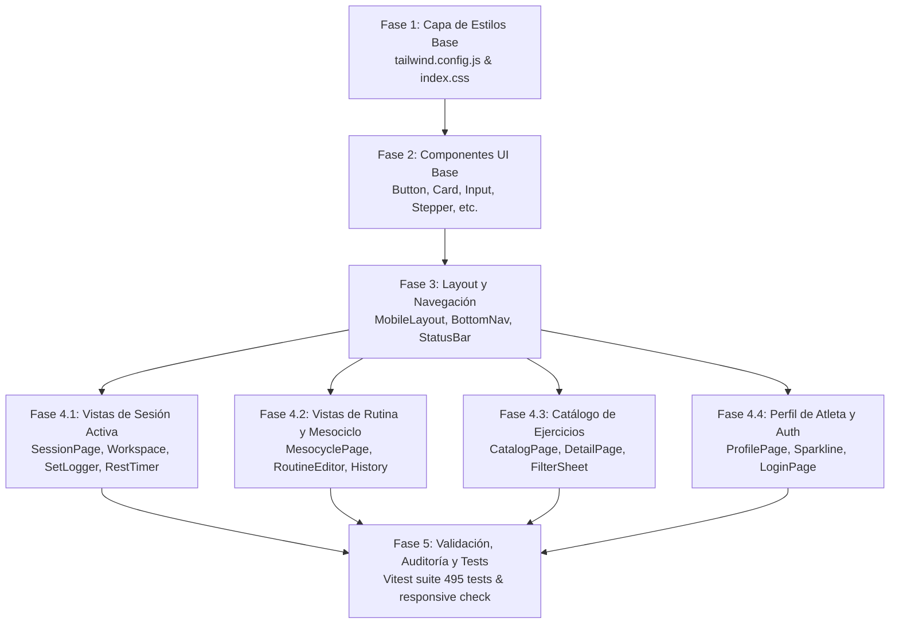

# 004 — SmartForge UI: Plan de Integración del Rediseño Visual Premium

> **Tipo:** Plan de implementación técnica  
> **Estado:** Aprobado / Plan Maestro  
> **Fecha:** 2026-10-07  
> **Especificación:** [004-premium-ui-redesign/spec.md](file:///f:/INGENIERIA/Proyectos%20Personales/SmartForge/specs/004-premium-ui-redesign/spec.md)  
> **Regido por:** [constitution.md](file:///f:/INGENIERIA/Proyectos%20Personales/SmartForge/docs/constitution.md) (R2 One-Hand Mobile, R4 Tests, R6 Español)  

---

## 1. Estrategia de Arquitectura y Regla de Invarianza de Negocio

El rediseño visual debe transformar radicalmente la apariencia visual de SmartForge sin introducir **ninguna alteración en la lógica de negocio ni en los contratos de datos**.

```
┌────────────────────────────────────────────────────────────────────────┐
│                        CAPA DE PRESENTACIÓN (UI)                       │
│    Tailwind CSS v4 · OKLCH Tokens · Glassmorphism · Micro-animaciones  │
│               [MODIFICADA PARA EXPERIENCIA PREMIUM]                   │
└────────────────────────────────────────────────────────────────────────┘
                                    │ (Eventos y Props)
                                    ▼
┌────────────────────────────────────────────────────────────────────────┐
│                  CAPA DE ESTADO Y NEGOCIO (INMUTABLE)                  │
│       React Query · offlineStore (IndexedDB) · useAuth · useOfflineSync│
│            [ESTRICTAMENTE INTACTA - CERO MODIFICACIONES]               │
└────────────────────────────────────────────────────────────────────────┘
                                    │ (Llamadas a red / caché)
                                    ▼
┌────────────────────────────────────────────────────────────────────────┐
│                 CAPA DE CONTRATOS Y RED (INMUTABLE)                    │
│            apiClient · OpenAPI Spec · Tipos DTOs generados             │
│            [ESTRICTAMENTE INTACTA - CERO MODIFICACIONES]               │
└────────────────────────────────────────────────────────────────────────┘
```

### 1.1 Reglas de Invarianza Estricta
1. **Contratos de Datos Inmutables:** Ninguna interfaz o tipo de `src/api/` (ej. `TrainingSession`, `SessionPlan`, `SetLog`, `UserProfile`, `Exercise`) puede ser alterado.
2. **Cero Alteraciones en IndexedDB:** Las transacciones y métodos de `src/stores/offlineStore.ts` se mantienen al 100%.
3. **Firmas de Hooks Preservadas:** Los hooks existentes (`useAuth`, `useOfflineSync`, `useVisualViewport`, etc.) no cambian su API pública ni su comportamiento.
4. **Retrocompatibilidad de Tests de Auditoría:** Para que los tests en `src/audit/` continúen pasando sin fricciones, los nuevos tokens cromáticos se definen como alias suplementarios en Tailwind y en el bloque `@theme inline` de CSS, conviviendo armoniosamente con los tokens previos.

---

## 2. Fases de Ejecución Paso a Paso



---

## 3. Fase 1: Capa de Estilos Base y Configuración

### Objetivo
Incorporar la paleta OKLCH, sombras con resplandores cromáticos (*glows*), utilidades de cristal (*glass*) y micro-animaciones en la infraestructura de estilos de la aplicación.

### Tareas Detalladas:

1. **Actualizar `frontend/tailwind.config.js`:**
   - Extender la paleta `colors` para añadir los tokens del prototipo Lovable sin eliminar los tokens existentes:
     ```javascript
     // Extensiones en colors:
     ink: 'oklch(0.15 0.004 286)',
     shell: 'oklch(0 0 0)',
     surface: {
       1: 'oklch(0.21 0.006 286)',
       2: 'oklch(0.274 0.006 286)',
       elevated: 'oklch(0.235 0.007 286)',
       disabled: 'oklch(0.274 0.006 286)',
     },
     brand: {
       DEFAULT: 'oklch(0.623 0.188 259.8)',
       primary: '#3B82F6', // Mantener hex para compatibilidad con tests
       focus: 'oklch(0.707 0.143 254.6)',
       contrast: '#0C0C0E',
     },
     neon: 'oklch(0.866 0.29 142.5)',
     success: 'oklch(0.723 0.192 149.6)',
     amber: 'oklch(0.769 0.165 70.1)',
     fatigue: {
       DEFAULT: 'oklch(0.637 0.208 25.3)',
       text: 'oklch(0.711 0.166 22.2)',
     },
     content: {
       DEFAULT: 'oklch(1 0 0)',
       1: 'oklch(1 0 0)',
       2: 'oklch(0.712 0.013 286)',
       3: 'oklch(0.552 0.014 286)',
       primary: '#FFFFFF',
       secondary: '#A1A1AA',
       disabled: '#71717A',
     },
     line: {
       DEFAULT: 'oklch(0.274 0.006 286)',
       strong: 'oklch(0.442 0.014 286)',
     }
     ```
   - Añadir utilidades de sombreado con glow (`boxShadow` extendido):
     - `'glow-brand'`: `'0 10px 25px -5px rgba(59, 130, 246, 0.3)'`
     - `'glow-neon'`: `'0 10px 25px -5px rgba(0, 245, 118, 0.2)'`
     - `'glow-amber'`: `'0 10px 25px -5px rgba(245, 158, 11, 0.3)'`
     - `'glow-success'`: `'0 10px 25px -5px rgba(34, 197, 94, 0.3)'`

2. **Actualizar `frontend/src/index.css`:**
   - Registrar las variables OKLCH dentro del selector `:root`:
     ```css
     --shell: oklch(0 0 0);
     --base: oklch(0.15 0.004 286);
     --surface-1: oklch(0.21 0.006 286);
     --surface-2: oklch(0.274 0.006 286);
     --surface-elevated: oklch(0.235 0.007 286);
     --brand-primary: oklch(0.623 0.188 259.8);
     --brand-focus: oklch(0.707 0.143 254.6);
     --neon-progress: oklch(0.866 0.29 142.5);
     --neon-progress-muted: oklch(0.723 0.192 149.6);
     --amber-energy: oklch(0.769 0.165 70.1);
     --fatigue-red: oklch(0.637 0.208 25.3);
     --fatigue-text: oklch(0.711 0.166 22.2);
     --content-primary: oklch(1 0 0);
     --content-secondary: oklch(0.712 0.013 286);
     --content-disabled: oklch(0.552 0.014 286);
     --border-subtle: oklch(0.274 0.006 286);
     --border-interactive: oklch(0.442 0.014 286);
     ```
   - Añadir utilidades CSS directas para rendimiento nativo:
     - `@utility glass`: fondo difuminado con desenfoque de 24px.
     - `@utility hero-gradient`: gradiente angular suave para tarjetas principales.
     - `@utility top-gradient`: borde superior de corona de 1px.
     - `@utility progress-gradient`: gradiente animado con efecto `shimmer`.
     - `@utility press`: compresión háptica visual `scale(0.97)` con duración de 100ms.
     - `@keyframes shimmer`: animación infinita de desplazamiento de luz en 3s.

3. **Verificación de Tipografías en `frontend/index.html`:**
   - Garantizar la carga optimizada de `DM Sans` (pesos 400, 500, 700, 800) y `JetBrains Mono` (pesos 500, 600, 700) vía Google Fonts con preconexión DNS.

---

## 4. Fase 2: Componentes UI Fundacionales (`src/components/ui/`)

### Objetivo
Adaptar los bloques de construcción visual para que adopten la estética deportiva de Lovable de forma homogénea.

### Tareas Detalladas:

1. **`Button.tsx`:**
   - Incorporar la clase utilitaria `press` en los estilos base de `buttonVariants`.
   - Añadir soporte para glows cromáticos:
     - `primary` / `brand`: `bg-brand text-content shadow-lg shadow-brand/30 hover:bg-brand/90`.
     - `success`: `bg-success text-ink font-extrabold shadow-lg shadow-success/30`.
     - `amber`: `bg-amber text-ink font-bold shadow-lg shadow-amber/30`.
     - `fatigue` / `destructive`: `bg-fatigue/15 text-fatigue-text hover:bg-fatigue/25` o fondo sólido con contraste.
   - Soportar tamaño de impacto maestro: `h-14` / `min-h-[56px]` para CTA crítico ("Registrar Serie").
   - Mantener debounce de 50ms para prevenir toques dobles involuntarios.

2. **`Card.tsx`:**
   - Actualizar el radio de bordes predeterminado a `rounded-2xl`.
   - Ajustar el fondo base a `bg-surface-1` y borde a `border-line` con sombra `shadow-brand/5`.
   - Incorporar variantes opcionales:
     - `hero`: fondo `hero-gradient` con resplandor `shadow-brand/10`.
     - `elevated`: fondo `bg-surface-elevated` con línea superior `top-gradient` y resplandor `shadow-neon/10`.

3. **`Input.tsx`:**
   - Actualizar el contenedor editable a `rounded-xl bg-surface-2 border border-line-strong text-content`.
   - Estado de foco: `focus-visible:ring-2 focus-visible:ring-brand-focus focus-visible:border-brand-focus`.
   - Etiquetas y unidades externas alineadas en tipografía monoespaciada con color `text-content-2`.
   - Preservar normalización automática de coma a punto decimal (RF-09).

4. **`AlertDialog.tsx` y `Sheet.tsx`:**
   - Envolver el contenedor emergente con estilo Bottom Sheet: `rounded-t-2xl bg-surface-1 border-t border-line-strong p-4 text-content shadow-2xl`.
   - Overlay con desenfoque de fondo: `bg-black/75 backdrop-blur-sm`.
   - Acciones primarias y secundarias con dianas táctiles ≥ 48px y soporte para interceptar el botón Atrás del navegador.

5. **Nuevos Componentes Compartidos:**
   - **`Stepper.tsx`:**
     - Implementar el componente reutilizable de incremento/decremento táctil:
     - Contenedor en `rounded-xl bg-surface-2 p-3`.
     - Botones `[ - ]` y `[ + ]` de 48×48px con clase `press`, borde `border-line-strong` y fondo `bg-surface-1`.
     - Contador numérico central en `font-mono text-2xl font-bold text-content` con unidad legible contigua.
   - **`Sparkline.tsx`:**
     - Componente SVG vectorial ligero para graficar historial de métricas (peso corporal, volumen por sesión).
     - Trazo nítido de 2.5px en `text-success` con gradiente semitransparente de relleno inferior y punto de anclaje final resaltado.

---

## 5. Fase 3: Layout y Navegación Principal

### Objetivo
Establecer el marco estructural móvil (390px centrado sobre fondo OLED puro) y la barra inferior de navegación flotante con puntero luminoso activo.

### Tareas Detalladas:

1. **`MobileLayout.tsx`:**
   - Configurar el fondo de página completa en `bg-shell` (`#000000`).
   - Centrar el marco de la aplicación móvil en `max-w-[390px] mx-auto min-h-screen bg-ink relative overflow-x-hidden border-x border-line/40`.
   - Asegurar que el contenedor scrolleable principal (`main`) disponga de padding inferior adaptativo:
     - `pb-28` para pestañas generales (Rutina, Catálogo, Perfil).
     - `pb-56` cuando la sesión activa está en curso para alojar tanto la `RestTimerBar` como la `BottomNav` sin superposiciones de contenido.

2. **`BottomNav.tsx`:**
   - Convertir el contenedor en barra de cristal: `glass relative border-t border-white/5 px-2 pt-2 pb-[calc(12px+env(safe-area-inset-bottom))]`.
   - Implementar la **barra indicadora deslizante activa**:
     ```tsx
     <span
       className="absolute top-0 h-0.5 w-1/4 bg-brand shadow-lg shadow-brand/50 transition-all duration-200"
       style={{ left: `${(activeIndex * 100) / 4}%` }}
     />
     ```
   - Cada pestaña interactiva con clase `press`, altura mínima de 48px, icono de 24px (`w-6 h-6`) y texto caption de 11px:
     - Activo: `text-brand-focus font-bold`.
     - Inactivo: `text-content-3 font-medium`.
   - Punto lumínico pulsante cuando hay una sesión activa de fondo.

3. **`StatusBar.tsx` & `KeyboardActionBar.tsx`:**
   - `StatusBar`: cabecera sutil con `glass border-b border-white/5` que preserve las safe-areas del dispositivo.
   - `KeyboardActionBar`: barra anclada sobre el teclado virtual de exactamente 64px (`h-16`) con botones táctiles de 48px y fondo `bg-surface-1 border-t border-line-strong`.

---

## 6. Fase 4: Modernización de Vistas Principales

### 6.1 Pantalla de Sesión Activa (`src/pages/session/`)
- **Cabecera Flotante de Sesión:**
  - `glass sticky top-0 z-20 -mx-4 -mt-4 border-b border-white/5 px-4 pb-3 pt-4`.
  - Beacon "EN VIVO" con `animate-ping` verde éxito y cronómetro en vivo en `font-mono`.
  - Botón "Finalizar" compacto con clase `press` y fondo `bg-fatigue/15 text-fatigue-text`.
  - Barra de progreso general de la sesión con clase `progress-gradient` y transición de 500ms.
- **Selector de Ejercicio en Curso:**
  - Tarjeta redondeada `rounded-2xl border border-line bg-surface-1 p-2` con botones chevron laterales de 48×48px (`press grid h-12 w-12 place-items-center rounded-xl bg-surface-2`).
  - Nombre del ejercicio con animación de entrada (`animate-in fade-in duration-200 truncate text-xl font-extrabold`).
- **Tarjeta de Sobrecarga Progresiva:**
  - Contenedor elevado `bg-surface-elevated rounded-2xl border border-line shadow-lg shadow-neon/10` con corona superior `top-gradient h-1`.
  - Badge pulsante con icono `TrendingUp`: "Incrementar carga" (`bg-neon/15 text-neon shadow-lg shadow-neon/20`).
  - Carga sugerida en tipografía gigante `font-mono text-4xl font-bold` con delta comparativo en verde neón (`+2.5 kg vs. sesión anterior`).
  - Justificación en prosa técnica en español.
- **Registro de Series (`SetLogger` / `ModularSetCard`):**
  - Historial de series completadas en tarjetas compactas con fondo `bg-success/10 border border-success/30 text-content` y checkmark redondeado en verde.
  - Formulario de serie activa con dos `Stepper`s (Carga en kg y Repeticiones).
  - Selector de RIR en cuadrícula de 5 columnas con botones redondeados `rounded-full` de 48px; opción seleccionada en `bg-brand text-content shadow-lg shadow-brand/30`.
  - Botón maestro "Registrar Serie" en verde éxito: `press flex min-h-14 w-full items-center justify-center gap-2 rounded-xl bg-success text-ink font-extrabold shadow-lg shadow-success/30`.
- **Temporizador de Descanso (`RestTimerBar`):**
  - Barra flotante de cristal `glass border-t border-white/5 px-4 py-3` anclada inmediatamente sobre la `BottomNav`.
  - Cronómetro regresivo en `font-mono text-3xl font-bold`.
  - Botón de incremento táctil `+30s` y botón ámbar de salto rápido (`bg-amber text-ink shadow-lg shadow-amber/30`).
  - Barra inferior de progreso en color ámbar con `transition-all duration-500 ease-out`.

### 6.2 Pantalla de Rutina y Mesociclo (`src/pages/mesocycle/` y `routine/`)
- **Tarjeta Hero del Mesociclo:**
  - Fondo `hero-gradient` con resplandor `shadow-lg shadow-brand/10` y esquinas `rounded-2xl`.
  - Badge de estado con punto pulsante: "Activo" en `bg-success/15 text-success`.
  - Título en `text-xl font-extrabold tracking-tight` y chips de metadatos en `bg-surface-2 text-content-2 rounded-full`.
  - Barra de progreso del mesociclo con `progress-gradient`.
- **Selector de Semanas:**
  - Cuadrícula con botones de semana de 48px; semana activa destacada en ámbar (`bg-amber text-ink shadow-lg shadow-amber/30`).
  - Semana de descarga (Semana 6) señalada con icono `Zap` y tarjeta de advertencia en ámbar (`border-l-4 border-amber bg-amber/10`).
- **Lista de Sesiones:**
  - Tarjetas de sesión con retardo de entrada escalonado (`animationDelay: ${idx * 60}ms`).
  - Iconos de sesión en contenedor cuadrado de 48px con acento de marca o éxito.
  - Botón de acción directo: "Iniciar" en `bg-brand shadow-brand/30` o badge de completada en verde con volumen total en kg.

### 6.3 Catálogo de Ejercicios (`src/pages/catalog/`)
- Buscador estilizado con `Input` táctil y botón de filtro con diana de 48px.
- Bottom Sheet de filtros (`FilterBottomSheet`) en lista vertical scrolleable con selección múltiple mediante chips táctiles y botón inferior "Aplicar filtros".
- Lista de ejercicios en tarjetas `rounded-2xl border border-line bg-surface-1` con micro-animación `press` y badges musculares en `bg-surface-2`.

### 6.4 Perfil del Atleta y Autenticación (`src/pages/profile/`, `auth/`)
- **Perfil del Atleta:**
  - Tarjeta de identificación del atleta con avatar circular en `bg-brand text-content shadow-brand/30`.
  - Módulo de peso corporal con telemetría en tiempo real (`font-mono text-3xl font-bold`), delta de tendencia con flecha direccional y componente `Sparkline` SVG.
  - Historial de pesajes en lista compacta con separadores `divide-line`.
  - Selectores de objetivo y experiencia migrados a `PillGroup` con iconos temáticos y botón inferior pegajoso `glass` para guardar cambios.
- **Login y Onboarding:**
  - Limpieza visual del formulario de login y asistente inicial de creación de perfil conservando todos los labels e inputs requeridos por los tests en español.

---

## 7. Fase 5: Validación, Auditoría y Testing

### 7.1 Protocolo de Pruebas Automatizadas
1. **Verificación de Auditoría Visual (`src/audit/`):**
   - Ejecutar `vitest run src/audit/` asegurando que los tests de tokens de color, tipografía, reset táctil, responsive overflow y reglas de español pasen al 100%.
2. **Suite Completa de Vitest:**
   - Ejecutar `npm test` en `frontend/` cubriendo los 495 tests unitarios y de integración de la aplicación.
3. **Validación de Cero Scroll Horizontal (CL-02):**
   - Correr `responsiveOverflow.test.tsx` en anchos de 320px, 360px y 390px sin desbordamiento horizontal.
4. **Validación de Accesibilidad WCAG (RNF-01):**
   - Ejecutar `accessibility.test.tsx` y `mobile-accessibility-audit.test.tsx` confirmando contrastes mínimos de 4.5:1 para texto y 3:1 para controles y bordes interactivos.

---

## 8. Matriz de Riesgos y Mitigación

| Riesgo Técnico Identificado | Impacto Potencial | Estrategia de Mitigación Diseñada |
|---|---|---|
| **Fallo en tests de tokens de color por cambio a OKLCH** | Fallo en `colorTokens.test.ts` que valida cadenas hexadecimales (`#0C0C0E`, `#3B82F6`, etc.). | Definir las variables OKLCH sin eliminar las variables hexadecimales en `:root` y `@theme inline`; mantener los alias hex como fallback de compatibilidad. |
| **Colapso de steppers o inputs numéricos en 320px** | Desborde horizontal o botones < 48px en iPhone SE. | Usar el patrón de Stepper de tres columnas con `grid-cols-[48px_minmax(0,1fr)_48px]` y `w-full` que se ajusta milimétricamente en pantallas estrechas. |
| **Solapamiento entre `RestTimerBar` y `BottomNav`** | El cronómetro de descanso o los botones de sesión quedan tapados por la barra inferior. | `MobileLayout` aplica dinámicamente `pb-56` cuando `tab === 'session'`, garantizando espacio vertical holgado para ambos componentes de cristal. |
| **Pérdida de datos en formularios al cambiar de vista** | Reset accidental de peso o reps mientras el atleta cambia de app o de pestaña. | Preservar íntegramente el estado local de la sesión activa y la sincronización con `offlineStore`, sin alterar los `onChange` ni `onBlur` handlers. |
